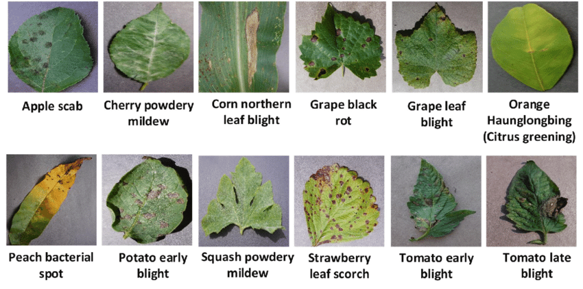
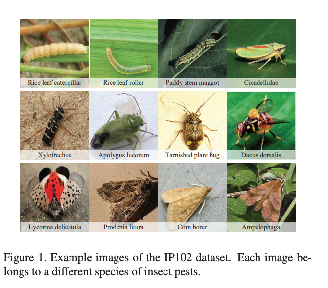

## AI-based tree disease early diagnosis system

This work is class project for Human Computer Interaction class in Winter semester 2023, at SeoulTech
- Healthy trees are the lungs of our planet, contributing to air quality, biodiversity, and climate regulation.
- AI-based tree disease early diagnosis system, which detects diseases at an early stage, saves individual trees and contribute to preserving entire ecosystems.
- Our work focus on building the light weight deep learning model which can deploy on mobile. The models not only predict tree disease based on input of leaf image but also Insect Pest Recognition
- We applied ZenNAS ( [https://github.com/idstcv/ZenNAS]) to search high-performance Network for Leaf diseases and pest detection.
- This source code based on [ZenNAS](https://github.com/idstcv/ZenNAS) work. We just modified for data processing. The Search stage, please go to the original ZenNAS works.
- ZenNet-leaf to provide in the folder ZenNet

## Datasets
 - PlantVillage dataset: 39 different classes of plant leaf and background images are available. Data-set contains 61,486 images and uses 6 different augmentation techniques (including image flipping, Gamma correction, noise injection, PCA color augmentation, rotation, and Scaling) for increasing the data-set size.
- To provide explanations for users, we collect data on diseases including: The description of symptoms, and effects on plants corresponding to the diseases already in the training dataset. (done)
- Link for describe [here ](docs.google.com/spreadsheets/d/1LBSx0iScU1mXUoYgMPJ8iS_8pSCSsUASgQjYUXlCDXk/)

[//]: # (![plant-sample]&#40;misc/plant-sample.png&#41;{width=400 height=2000})



 - IP102 dataset: IP102 is a large-scale benchmark dataset for Insect Pest Recognition. It contains more than 75,000 images belonging to 102 categories, which exhibit a natural long-tailed distribution. In addition, they annotate about 19 000 images with bounding boxes for object detection

 - 
[//]: # (![pest-sample]&#40;misc/pest-sample.png&#41;)

## System Requirements

* PyTorch >= 1.5, Python >= 3.7

## Search setting
The evolutionary population size is 256, the number of evolutionary iterations T=96000
Search space: We use ZenNAS to search lightweight network with small FLOPs. And we use MobileNet search space. This search space consists of MobileNet blocks that uses depth-wise separable convolutions to build lightweight deep neural networks that can have low latency for mobile and embedded devices
Constraints: Flops= 600M
We set resolution are 224x224 for IP-102 dataset and 256 x 256 for PlantVillage dataset
The network for IP-102 we call ZenNets-IP102, the other is ZenNets-Plant

## Training setting
- Augmentation:  We use the following augmentations: mix-up, label-smoothing, random erasing, random crop/resize/flip/lighting and AutoAugment.
- Optimizer: For all experiments, we use SGD optimizer with momentum 0.9; weight decay 5e-4; initial learning rate 0.1 with batch size 256; cosine learning rate decay. We train models up to 480 epochs both of datasets

scripts/train.sh
``` bash
scripts/train.sh
```
## Results

These following tables provide ours results. For ZenNets-Plant, the Accuracy at top1 outperforms Light-Choma Inception V3 with small Flops. For ZenNets-IP102, the accuracy is 20% higher than the others with light-weights and training from scratch
(Note: (+) using pretrain ; (-) training from scratch ; **Flops**: floating point operations per second
)

| model                        | resolution | \# params | FLOPs | Top-1 Acc | 
|------------------------------|------|--------|-------|---------|
| ZenNets-Plans (-)            | 256  | 6.8M   | 465M  | **99.82%**  | 
| LightChroma Inception V3 (-) | 256  | 5M     | 700M  | 99.48%  |

| model                        | resolution | \# params | FLOPs | Top-1 Acc | 
|------------------------------|------------|-----------|-------|-----------|
| ZenNets-IP102 (-)           | 224        | 8M        | 600M  | **63.8%** | 
|AlexNet (+) | 224        | 61.1MM    | 720M  | 41.8 %    |
|GoogleNet (+) | 224        | 7M        | 1566M | 43.5 %   |
|ResNet (+) | 224        | -         | -     | 49.4%    |
